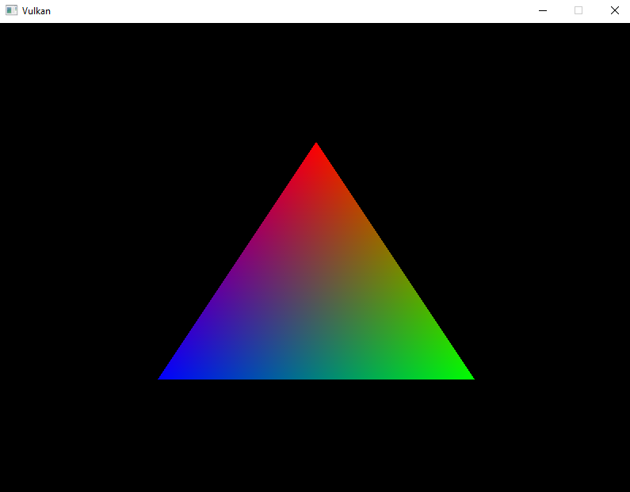
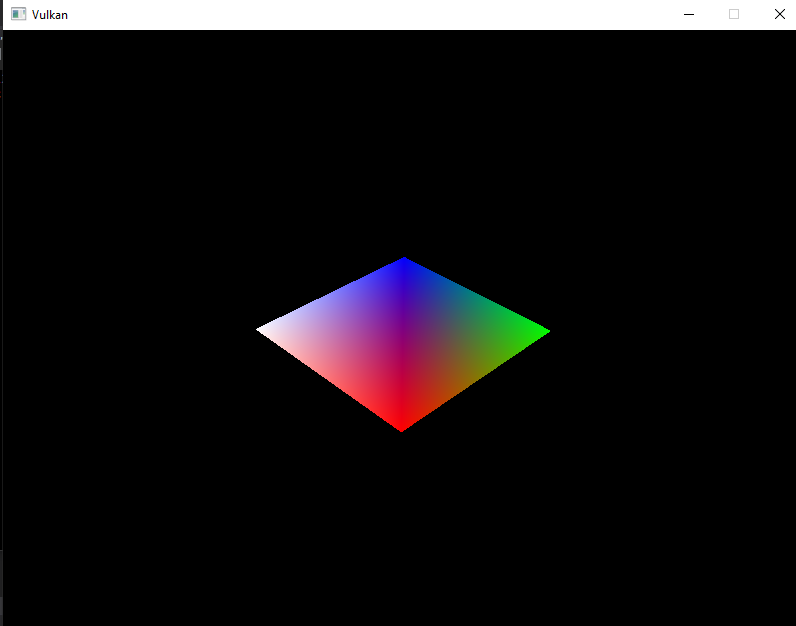
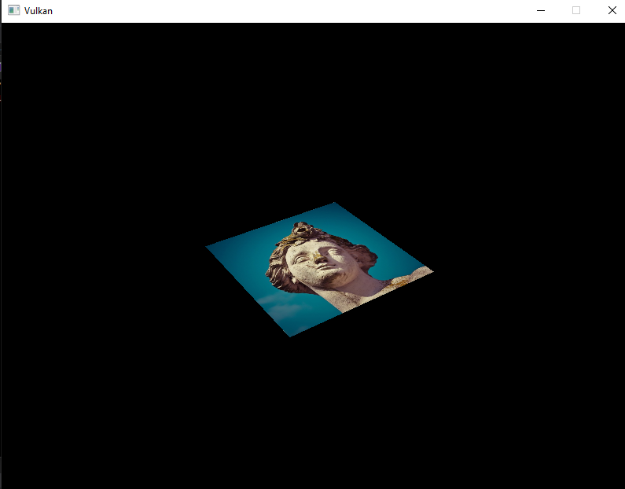

Vulkan Hello World
==================

This is my implementation of [Vulkan Tutorial](https://vulkan-tutorial.com/Introduction). Some images 
and their stages:

Triangle

Usage of uniform variables and projections

Textured square

Dependancies
----------------------

* [VulkanSDK](https://vulkan.lunarg.com/): For this is vulkan API code
* [GLFW](https://www.glfw.org/): Window management
* [GLM](https://glm.g-truc.net/0.9.9/index.html): For linear algebra and data types (included in VulkanSDK)
* [stb](https://github.com/nothings/stb): stb_image.h from this library for loading image (texture)
